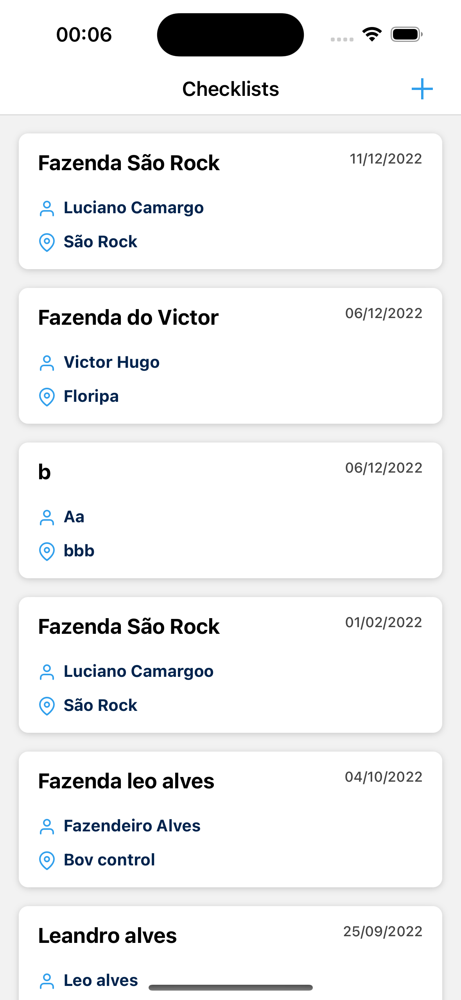
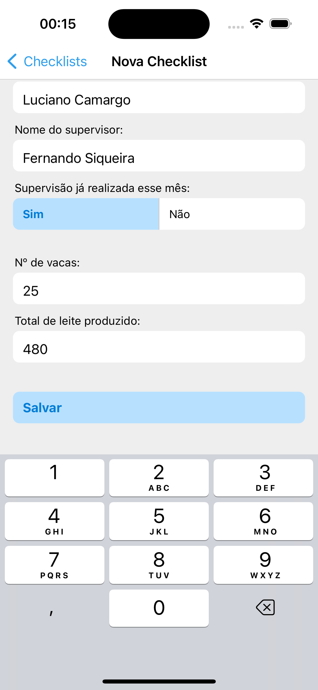
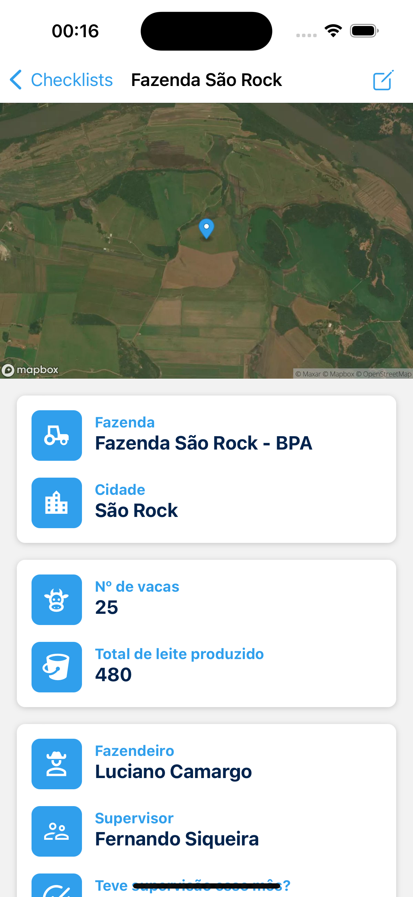
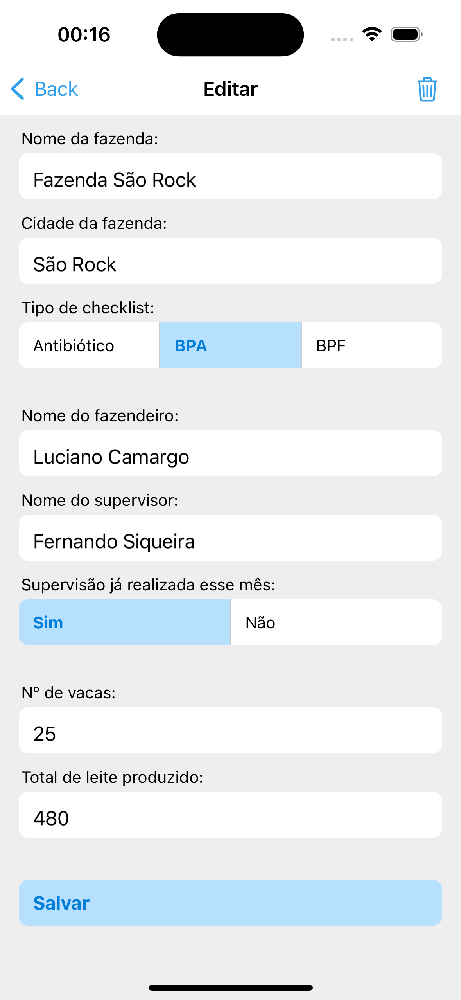

# Desafio Bovcontrol

<p>
  <!-- iOS -->
  
  <!-- Android -->
  
</p>

<p float="left">
  
  
  
  
</p>

## 🧑‍💻 Tecnologias utilizadas

- [TypeScript](https://www.typescriptlang.org/)
- [React Native](https://reactnative.dev/)
- [Expo](https://expo.dev/)
- [React Navigation](https://reactnavigation.org/)
- [React Hook Form (Validação de formulários)](https://react-hook-form.com/)
- [React Query (Data fetching & Migrations offline persistence)](https://tanstack.com/query/v4/)
- [Realm (Banco de dados)](https://realm.io/)

## 📲 Como executar

[Configurar ambiente de desenvolvimento](https://reactnative.dev/docs/environment-setup)

### 🍎 iOS

```
yarn ios
```

```
npm run ios
```

### 🤖 Android

```
yarn android
```

```
npm run android
```
